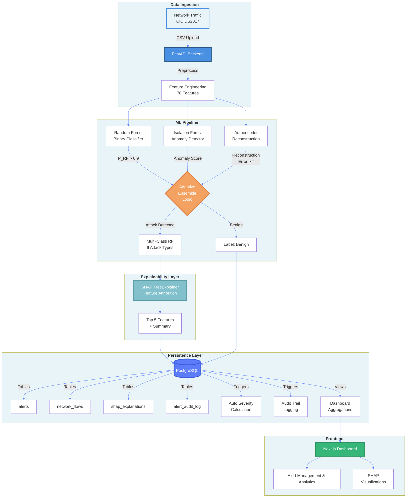

# XRAID: eXplainable Robust Adaptive Intrusion Detection System

> **An adaptive hybrid ensemble framework for network intrusion detection using supervised, unsupervised, and deep reconstruction learning with SHAP explainability.**


## Key Features

- **Adaptive Ensemble Detection** - Combines Random Forest, Isolation Forest, and Autoencoder with confidence-based decision logic
- **99.57% Binary Accuracy** - Validated on CICIDS2017 with 100% precision and ROC-AUC of 0.9898
- **Multi-Class Categorization** - Identifies 9 attack types: DDoS, DoS, PortScan, BruteForce, WebAttack, Botnet, Infiltration, Exploit
- **SHAP Explainability** - Per-alert feature attributions for model transparency and analyst trust
- **Production-Ready Backend** - FastAPI + PostgreSQL with triggers, constraints, audit logs, and pre-built views
- **Real-Time Dashboard** - Next.js frontend with time-series analytics, alert management, and SHAP visualizations


## System Architecture



## Performance Metrics

| Model / Ensemble | Accuracy | Precision | Recall | ROC-AUC |
|------------------|----------|-----------|--------|---------|
| Random Forest | 99.85% | 99% | 100% | - |
| Isolation Forest | 79.22% | 39% | 10% | 0.74 |
| Autoencoder | 80.25% | 0% | 0% | 0.74 |
| **Adaptive Ensemble** | **99.57%** | **100%** | **98%** | **0.990** |

**Multi-Class Accuracy:** 99.55% across 9 attack categories

Unsupervised models underperform in standalone binary classification but provide complementary anomaly signals that improve ensemble robustness.

## Model Training

```bash
cd backend
python training.py
```

**Dataset:** CICIDS2017 (2.83M flows, 78 features, 9 attack types)  
**Models Generated:** RF (binary + multi-class), Isolation Forest, Autoencoder


## Database Schema

### Core Tables

- **alerts** : Central hub storing all detection events (prediction, confidence, status, severity)
- **network_flows** : Raw 78-feature CICIDS2017 flow data (JSONB)
- **shap_explanations** : SHAP values, top features, natural-language summary (JSONB)
- **alert_audit_log** : Immutable append-only audit trail

### Key Features

- **14 CHECK constraints** : Enforce confidence ranges, port numbers, enum domains
- **ON DELETE CASCADE** : Auto-cleanup of flow/SHAP records
- **3 Triggers** : Auto-update timestamp, auto-calculate severity, audit logging
- **11 B-Tree indexes** : Optimize timestamp/status/confidence queries
- **3 GIN indexes** : Accelerate JSONB containment queries
- **3 Pre-built Views** : Dashboard aggregations

## Adaptive Ensemble Logic

```python
# Confidence-based decision rules
if (rf_pred == 1 and if_pred == 1):
    return "Attack"  # High-confidence consensus
elif rf_proba > 0.9:
    return "Attack"  # RF very confident
elif (ae_error > threshold * 1.2) and (rf_pred == 0) and (if_pred == 0):
    return "Attack"  # Conservative AE override
else:
    return "Benign"
```

**Why Adaptive?**
- Trusts the strong RF+IF combination
- Allows Autoencoder to flag novel attacks only when very confident
- Avoids false positives from unsupervised models
- Outperforms fixed-weight and naive voting strategies

## SHAP Explainability

For each alert, XRAID computes:

1. **SHAP values** — Contribution of each of the 78 features to the prediction
2. **Top 5 features** — Ranked by absolute SHAP value with feature values
3. **Natural-language summary** — Human-readable explanation of the detection

## Tech Stack

**Backend:**
- FastAPI (async API)
- PostgreSQL (relational persistence)
- SQLAlchemy + Alembic (ORM + migrations)
- TensorFlow + Keras (Autoencoder)
- scikit-learn (RF, IF, preprocessing)
- SHAP (explainability)

**Frontend:**
- Next.js 13 
- TypeScript 
- Tailwind CSS 

## License

MIT License - see [LICENSE](LICENSE) for details
